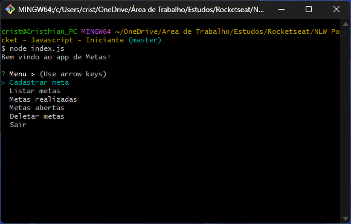

# App de Controle de Metas

**Projeto desenvolvido no evento Next Level Week Pocket JavaScript da Rocketseat, workshop prático com foco na tecnologia JavaScript.**

## Descrição

O aplicativo de controle de metas é um software de linha de comando desenvolvido em Node.js que utiliza o módulo Inquirer.js para criar uma interface interativa com o usuário.

Ele permite aos usuários:

* **Cadastrar novas metas:** Adicionar metas a serem alcançadas.
* **Listar metas:** Visualizar todas as metas cadastradas.
* **Marcar metas como concluídas:** Indicar quais metas foram alcançadas.
* **Ver metas realizadas:** Exibir um relatório das metas concluídas.
* **Ver metas abertas:** Exibir um relatório das metas pendentes.
* **Deletar metas:** Remover metas que não são mais relevantes.

## Como usar

1. **Instalação:**
   * Certifique-se de ter o Node.js e npm (ou yarn) instalados.
   * Clone este repositório ou baixe o código-fonte.
   * Abra o terminal e navegue até a pasta do projeto.
   * Execute o comando `npm install` para instalar as dependências.

2. **Execução:**
   * Execute o comando `node index.js` para iniciar o aplicativo.

3. **Interação:**
   * Siga as instruções no terminal para navegar pelas opções e interagir com o aplicativo.

## Estrutura do Projeto

* **index.js:** Arquivo principal que contém a lógica da aplicação.
* **metas.json:** Arquivo onde as metas são armazenadas.

## Tecnologias Utilizadas

* **JavaScript:** linguagem de programação interpretada
* **Node.js:** ambiente de execução JavaScript
* **Git:** ferramenta para controle de versionamento de código

## Funcionamento

* **Cadastro de metas:** O usuário digita uma nova meta, que é adicionada a um array em memória e salva no arquivo `metas.json`.
* **Listagem de metas:** As metas são carregadas do arquivo `metas.json` e apresentadas ao usuário em formato de lista, permitindo marcar as metas como concluídas.
* **Marcação de metas:** Ao marcar uma meta como concluída, o status da meta é atualizado no array em memória e no arquivo `metas.json`.
* **Relatórios:** Os relatórios de metas realizadas e abertas são gerados filtrando o array de metas com base no status de conclusão.
* **Deleção de metas:** O usuário seleciona as metas que deseja excluir, e elas são removidas do array em memória e do arquivo `metas.json`.

## Agradecimentos

Agradeço ao time da Rocketseat por disponibilizar esse evento para a comunidade!
